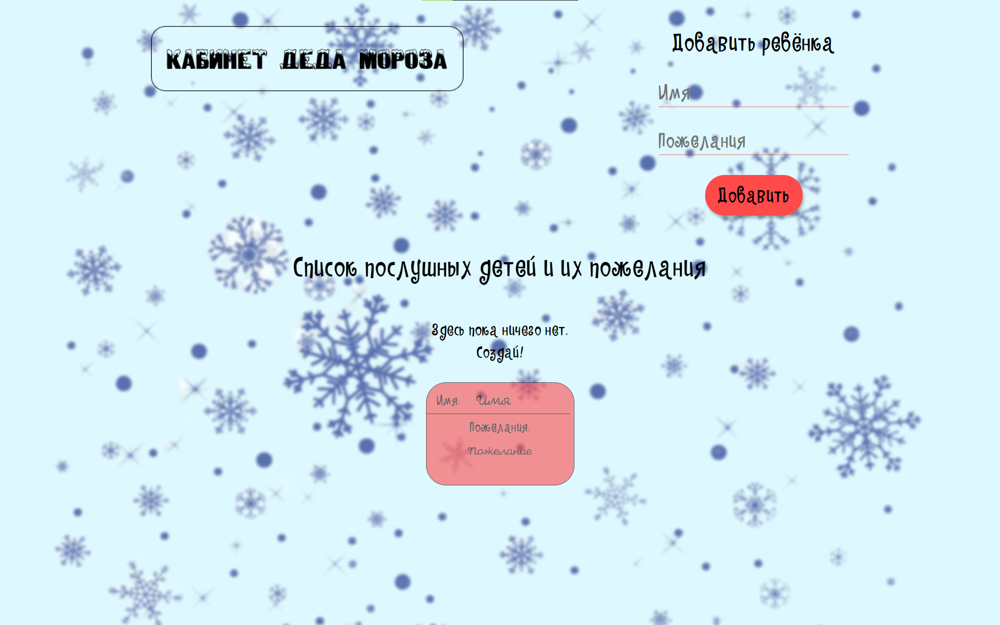
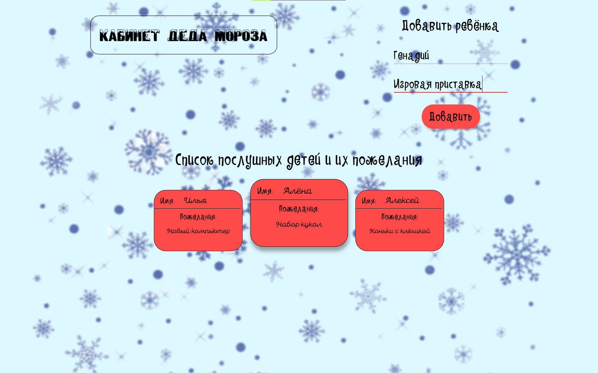
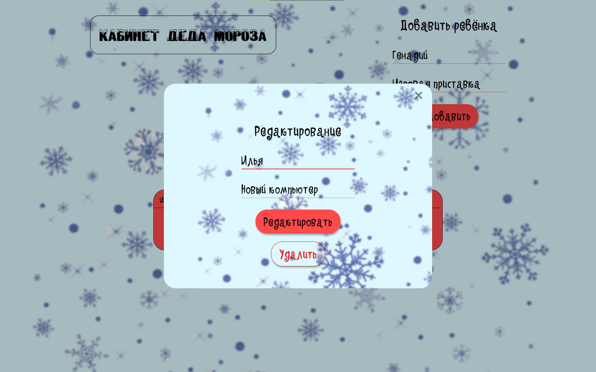

# Кабинет Деда Мороза
Сайт для истинных дедов Морозов🎅🎅🎅

## Скрины




## Как запустить
1. Скачайте проект
2. Откройте проект в vs code и запустите через терминал ```npm i```, затем ```npm run start```
3. Перейдите по ссылке http://localhost:3000
## Необходимые зависимости
1. Node.js
2. VS Code